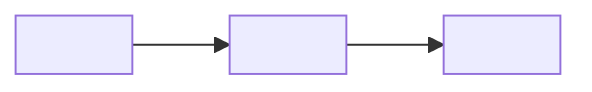

# <slug>

> <full description, identical to the `description` field of the SKILL.md frontmatter and plugin.json>

- **Created**: `<YYYY-MM-DD>`
- **Last updated**: `<YYYY-MM-DD>`



## Installation

```
/plugin marketplace add <github_user>/<repo_name>
/plugin install <slug>@<repo_name>
```

Slash: `/<slug>`. Update: `/plugin marketplace update <repo_name>`.

## License

MIT — see [LICENSE](../../LICENSE).

<!--
Substitutions to do at generation time (skill-creator-flo Step 7 Type A):

- <slug>           : value from Step 3
- <description>    : value from Step 4 (full description, as-is)
- <YYYY-MM-DD>     : current date (`date +%Y-%m-%d`). On creation, both dates equal today. On modification (M.7), only "Last updated" is re-patched; "Created" is immutable.
- <main input>     : main input of the skill (e.g.: "markdown file", "sticky notes", "transcript", "Drive URL"). 1-3 words.
- <main output>    : main output (e.g.: "PRD scenario", "Mermaid flowchart", "CSV report", "generated skill"). 1-3 words.
- <github_user>    : config.github_user (github mode); otherwise local path
- <repo_name>      : `repo_name` or `beta_repo_name` depending on the context chosen at Step 0.1

Local mode: replace `/plugin marketplace add <github_user>/<repo_name>` with `/plugin marketplace add <repo_dir>` (absolute path).

No "Use case", "Contents", or "For other tools" sections — the root README covers multi-tool install, and the frontmatter description (quoted as blockquote above) doubles as the use case. Keep the plugin README minimal: title + description + dates + mermaid + install + license. Target ≤ 25 lines excluding comment.
-->
